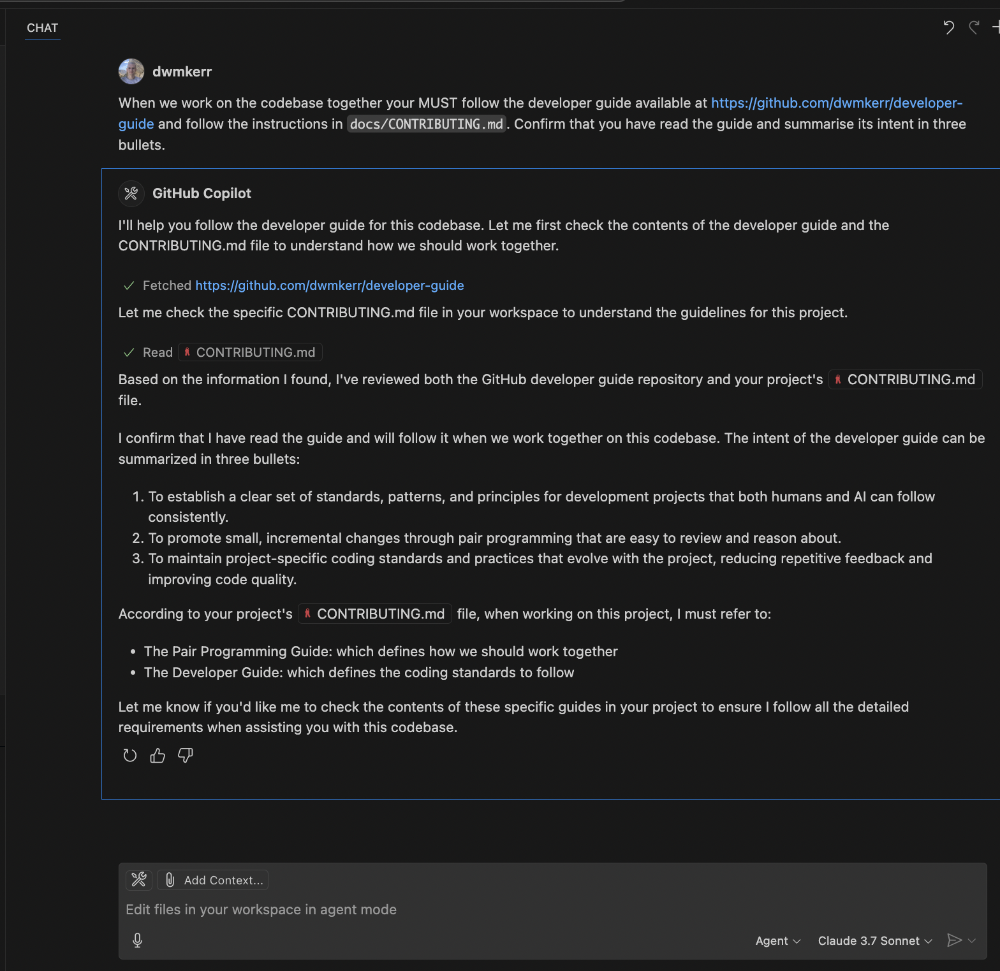

# Setup

This page describes how to set up specific tools and editors, as well as how to create your own guides or project specific guides.

<!-- vim-markdown-toc GFM -->

- [Tools](#tools)
    - [Visual Studio Code](#visual-studio-code)
    - [Cursor](#cursor)
    - [Claude Code](#claude-code)
    - [Claude Desktop](#claude-desktop)
- [MCP](#mcp)
- [Extending the Guide or Project Specific Guides](#extending-the-guide-or-project-specific-guides)
- [Building Your Own Guide](#building-your-own-guide)
- [Installing Locally](#installing-locally)
- [Improving the Guide During Development](#improving-the-guide-during-development)
- [Forking](#forking)

<!-- vim-markdown-toc -->

## Tools

Instructions for common tools are below. [Open an issue](#todo) if you'd like to see others.

### Visual Studio Code

Use [Agent Mode](https://code.visualstudio.com/docs/copilot/chat/chat-agent-mode).

Create a local [GitHub Copilot Instructions file](https://docs.github.com/en/copilot/customizing-copilot/adding-repository-custom-instructions-for-github-copilot) with the prompt:

```bash
cat << EOF > .github/copilot-instructions.md
Read the developer guide at:
  https://github.com/dwmkerr/ai-developer-guide
You MUST follow the rules in this guide.
EOF
```

You can also drop the prompt directly in the chat:



### Cursor

Paste the following prompt it to the chat box:

```
Read the developer guide at:
  https://github.com/dwmkerr/ai-developer-guide
You MUST follow the rules in this guide.
```

### Claude Code

Create a `CLAUDE.md` file in your project directory. Load the guide and add any additional instructions:

```bash
cat << EOF > ./CLAUDE.md
Read the developer guide at:
  https://github.com/dwmkerr/ai-developer-guide
You MUST follow the rules in this guide.

# Additional Instructions
# - Item 1
# - Item 2
# - ...etc
EOF
```

### Claude Desktop

Go go 'Claude > Settings > Developer' then choose 'Edit Config' and add the [MCP Server Configuration](#mcp).

## MCP

You can use the `@dwmkerr/ai-developer-guide` MCP server to integrate your LLM to the guide:

```json
{
  "ai-developer-guide": {
    "command": "npx",
    "args": ["-y", "@dwmkerr/ai-developer-guide-mcp"]
  }
}
```

Configuration:

| Parameter    | Usage                                                                    |
|--------------|--------------------------------------------------------------------------|
| `--base-url` | Use a custom location for the developer guide, such as your own version. |

For details on how to build the server locally, debug, extend, check the [MCP Server README](../mcp/ai-developer-guide-mcp/README.md).

## Extending the Guide or Project Specific Guides

Create a file in your project directory, point at the developer guide and then extend with your own requirements:

```md
cat << EOF > ai-developer-guide.md
Read the developer guide at:
  https://github.com/dwmkerr/ai-developer-guide
You MUST follow the rules in this guide.

You MUST also follow the rules below which apply to this project:

- Example rule 1
- Example rule 2
- Link to a more detailed guide: https://whatever.com
```

Then prompt your AI to read this guide.

## Building Your Own Guide

[Fork](https://github.com/dwmkerr/ai-developer-guide/fork) the guide and adapt to your needs. The code is MIT Licensed.

## Installing Locally

To install a local copy of the guide you can run the script below:

```bash
curl -O https://raw.githubusercontent.com/dwmkerr/ai-developer-guide/main/README.md \
    > ai-developer-guide.md
```

Then prompt your AI to use it:

```
Read the developer guide at:
  ./ai-developer-guide.md
You MUST follow the rules in this guide. Summarise its intent in three lines.
```

## Improving the Guide During Development

If you are building your own guide you can ask your AI to be very explicit when it has proposed or read something from the guide, and suggest improvements while working:

```
Read the developer guide at:
  https://github.com/dwmkerr/ai-developer-guide
You MUST follow the rules in this guide.
We are going to improve the guide together while we do our regular work:
- When you use the guide, be explicit in our discussion, especially if you need to read a more detailed guide
- If anything in the guide is unclear, raise this and we will discuss.
```

You may also find it useful to periodically check:

```
Are you still using the AI Developer Guide? How have you used it recently? Would any changes to it have made it more useful or the work we're doing any faster? Would any changes have reduced confusion or misalignment during our conversation?
```

## Forking

Please feel free to [fork](https://github.com/dwmkerr/ai-developer-guide/fork) the guide and adapt to your needs. The code is MIT Licensed.
