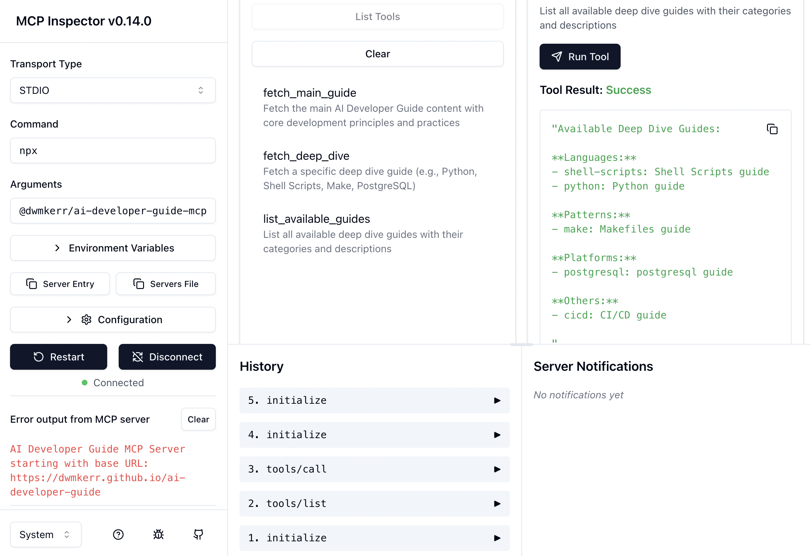

# AI Developer Guide MCP Server

A simple MCP server that connects your LLM to the developer guide:

```
┌──────────┐  GitHub Action  ┌─────────────────────┐
│   Repo   │────────────────▶│ Developer Guide     │
└──────────┘                 │ (GH Pages)          │
                             └─────────────────────┘
                                        ▲
                                        │ JSON APIs
┌──────────┐       MCP       ┌─────────────────────┐
│   LLM    │────────────────▶│ AI Dev Guide        │
└──────────┘                 │ MCP Server          │
                             └─────────────────────┘
```

- The developer guide is exposed as a set of JSON files on a server
- In this case, via GitHub pages
- These files can be loaded via HTTP GET, which makes them simple APIs
- The MCP server hits the APIs to get guide content

<!-- vim-markdown-toc GFM -->

- [Quickstart](#quickstart)
- [Local Development](#local-development)
- [Available Tools](#available-tools)
- [Example LLM Interactions](#example-llm-interactions)
- [Configuration](#configuration)
- [API Requirements](#api-requirements)

<!-- vim-markdown-toc -->

## Quickstart

Use the following MCP configuration:

```json
"ai-developer-guide": {
  "command": "npx",
  "args": ["-y", "@dwmkerr/ai-developer-guide-mcp"]
}
```

Try a prompt like:

> "Read the ai developer guide and tell me what the guiding principles are"

## Local Development

Run `make` to see useful commands:

```
make

build: Build the code for distribution
help: Show help for each of the Makefile recipes
init: Install dependencies
...etc
```

To test all elements locally you'll need to build the site that serves the APIs, run the site, run the MCP server and point it to the local site, and then configure your MCP client.

First run the site locally:

```bash
# From repo root run the site, runs on http://localhost:9090
make site-build && make site-run
```

Build the server locally:

```bash
npm run build
# optionally install locally with npm install -g .
```

Point your MCP client, such as Cursor or Claude Desktop, to the local server:

```json
{
  "mcpServers": {
    "ai-developer-guide-local": {
      "command": "node",
      "args": ["/path/to/ai-developer-guide/mcp/ai-developer-guide-mcp/dist/cli.js", 
               "start", "--base-url", "http://localhost:9090"]
    }
  }
}
```

At this point you can prompt the LLM with instructions like:

- "What Python patterns should I follow?"
- "Show me CI/CD best practices" 
- "What guides are available?"

You can also run locally with live reload:

```bash
npm run dev -- start --base-url http://localhost:9090
```

The server logs all activity to `stderr` (standard error) following MCP conventions.

And you can quickly test with the MCP inspector:

```bash
npx @modelcontextprotocol/inspector node ./dist/cli.js start --base-url http://localhost:9090
# Or test against production: npx @modelcontextprotocol/inspector -- npx @dwmkerr/ai-developer-guide-mcp
```

<a href="https://github.com/modelcontextprotocol/inspector"></a>

## Available Tools

When connected to an LLM via MCP, the following tools are available:

- **`fetch_main_guide`** - Get the core AI Developer Guide content
- **`fetch_guide`** - Get specialized guides (Python, Shell Scripts, Make, PostgreSQL, etc.)
- **`list_available_guides`** - List all available guide topics

## Example LLM Interactions

Once connected to your LLM (like Claude in Cursor), you can ask questions like these:

**Getting Started**

> "What are the main principles in the AI Developer Guide?"

The LLM will use `fetch_main_guide` to get the core development principles and Plan/Implement/Review approach.

**Language-Specific Guidance**

> "Show me Python best practices for AI-assisted development"
> 
> "What are the shell scripting guidelines from the developer guide?"
>
> "What Python patterns should I follow?"

The LLM will use `fetch_guide` with category `languages` and topics like `python` or `shell-scripts`.

**Tool and Pattern Guidance**

> "How should I structure my Makefiles according to the guide?"
> 
> "What CI/CD practices does the guide recommend?"
>
> "Show me the Makefile patterns and conventions"
>
> "What are the best practices for CI/CD?"

The LLM will fetch guides for `patterns/make` or `others/cicd`.

**Discovery and Exploration**

> "What guides are available?"
> 
> "List all the specialized guides you have access to"
>
> "What patterns and best practices can you help me with?"

The LLM will use `list_available_guides` to show all categories and topics.

**Practical Scenarios**

> "I'm setting up a new Python project with PostgreSQL. What guidance does the developer guide provide?"

The LLM will fetch multiple guides (`languages/python` and `platforms/postgresql`) to give comprehensive advice.

> "Help me review this shell script using the developer guide principles"
>
> "What conventions should I follow for shell scripts?"

The LLM will get the main guide for review principles, then the shell scripts guide for specific best practices.

## Configuration

You can point the server to your own AI Developer Guide deployment:

```bash
# Set the base url via env var:
export AI_DEVELOPER_GUIDE_URL="https://your-domain.com/your-guide"
ai-developer-guide-mcp start

# or via a CLI parameter:
ai-developer-guide-mcp start --base-url "https://your-domain.com/your-guide"
```

You can configure your MCP server using these parameters:

```json
{
  "mcpServers": {
    "ai-developer-guide": {
      "command": "ai-developer-guide-mcp",
      "args": ["start", "--base-url", "https://your-domain.com/your-guide"]
    }
  }
}
```

## API Requirements

The API structure should match the [AI Developer Guide API format](https://dwmkerr.github.io/ai-developer-guide/api.json).
